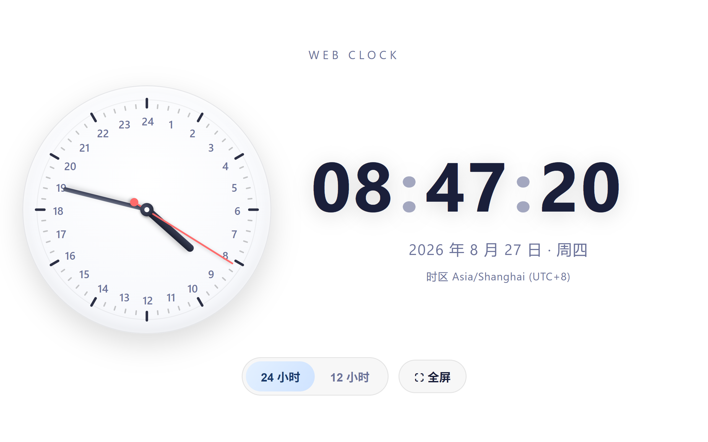

[English](README.md) | [简体中文](README_Simplified_Chinese.md) | [繁體中文](README_Classical_Chinese.md)

## 一、總體功用
- **雙鐘並陳**：模擬指針之鐘（錶盤）與數字之鐘（時分秒）同時並見。
- **時制更易**：可於十二辰與二十四辰之間轉換，更易之際，錶盤之數（一至于十二，或一至于二十四）與數字之鐘皆同步而變。
- **時刻常新**：每瞬（實每五十毫秒一重新，使秒針之行若流水）而更新，以示當下之時刻、日期、星期並時區。
- **全屏之態**：按「全屏」之鈕，可入或出瀏覽器之全屏。

---

## 二、界面佈局
- 居中而縱列，自上而下：
  1. **題名**：曰「WEB CLOCK」。
  2. **鐘之域**：左為模擬之鐘（徑三百像素），右為數字之鐘（大字以顯時分秒，其下著日期與時區）。
  3. **控御之欄**：含十二辰與二十四辰切換之鈕（滑動之式）及全屏之鈕。

---

## 三、模擬之鐘（錶盤）
- **指針**：時針、分針、秒針，藉 CSS 之 `transform: rotate()` 以動；秒針若流水（因定時之器間隔五十毫秒）。
- **刻度**：成六十刻線，每五而一長刻（是為主刻）。
- **數字**：隨制式而動生一至于十二、或一至于二十四之數，依三角之法均布於圓周（二十四辰之數較小而內斂）。
- **中心之飾**：小圓點以為軸心。

---

## 四、數字之鐘
- 顯時、分、秒，用等寬之字（`tabular-nums`）；兩點之間有明滅之動（每二秒一變）。
- 十二辰之制則顯 AM/PM；二十四辰則隱之。
- 其下著日期（年、月、日、星期）與時區之名，及 UTC 之偏移。

---

## 五、交互與控御
- **十二辰與二十四辰之更易**：
  - 採「滑動」之制。按鈕之時，高亮之底（`thumb`）緩滑至所按之處（藉 `offsetLeft` 與 `offsetWidth` 以算）。
  - 更易之後，重鑄錶盤之數，即時更新當下之時刻。
- **全屏**：調瀏覽器全屏之介（`requestFullscreen` / `exitFullscreen`）。

---

## 六、技藝之要
- **純本然之 JavaScript**，無外援之賴。
- **CSS 之變數**（`:root`）定其色，便於改易主題。
- **應變之式**：用 `flex` 之佈局，控御之條自相折行。
- **效能**：`setInterval` 間隔五十毫秒，使秒針若流水，且同新數字之鐘與錶盤。
- **時區之取**：藉 `Intl.DateTimeFormat().resolvedOptions().timeZone` 以得當下時區之名，並算 UTC 之偏移。

---

## 七、樣式之風
- 簡約、圓融，若毛玻璃之感（`radial-gradient` 之底，卡片半透）。
- 指針以色別之：時針深，分針灰，秒針赤。
- 交互之應柔和（色之遷變、滑動之動）。

## 版權

[MIT](LICENSE)
